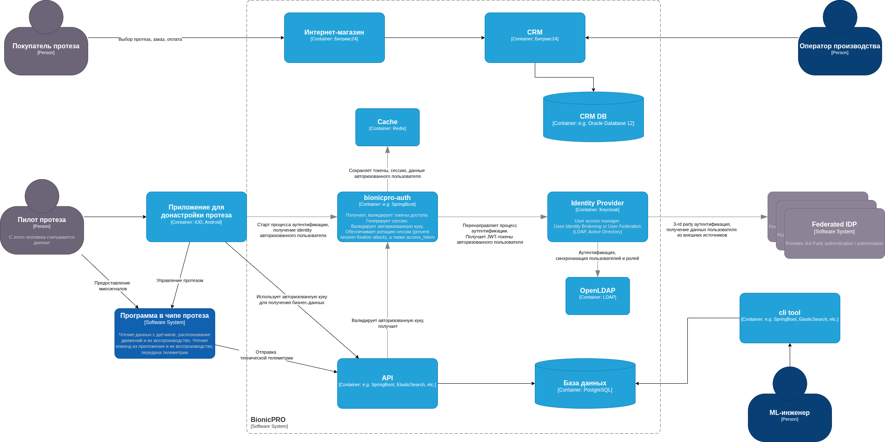

# Кейс компании BionicPRO
## Цели бизнеса
Компания BionicPRO ставит перед собой следующие цели:
1) Злоумышленники не должны использовать уязвимость SSO в приложении.
2) У пользователей должна быть возможность скачать данные о работе протеза в виде отчёта. Чтобы реализовать эту функциональность, необходимо выгружать данные из CRM в ClickHouse. Для этого требуется написать отдельное приложение, которое сможет предоставлять отчёт из нескольких источников — CRM и DB.
3) Пользователь должен иметь доступ только к тем отчётам, которые содержат данные о его протезе или протезах. Доступ к информации о других пользователях должен быть закрыт.

## Задание 1. Повышение безопасности системы
### Задача 1. Предложите архитектурное решение и доработайте диаграмму C4 для управления учётными данными пользователя. 


### Задача 2. Улучшите безопасность существующего приложения, заменив Code Grant на PKCE.
_Его нужно добавить к уже существующим приложениям — фронтенду и Keycloak._

[PKCE code](./Task_1/app_pkce)

[realm-front-pkce.json](./keycloak/realm-front-pkce.json)

```bash
cd ./Task_1/app_pkce
docker compose up -d
```


### Задача 3. Обеспечьте безопасное получение и хранение access-и refresh-токенов.
### Задача 4. Добавьте LDAP для возможности получения данных о пользователях представительства BionicPRO в другой стране.
### Задача 5. Настройте MFA.

[Backend Auth Service code](./Task_1/app_bionicpro_auth)

[keycloak-results-export.json](./keycloak/keycloak-results-export.json)

```bash
cd ./Task_1/app_bionicpro_auth
docker compose up -d
```

#### Keycloak Panel
http://localhost:8080/admin/master/console/

#### Application

http://localhost:3000/


##### Выгрузка конфига из Keycloak
```bash
docker exec bionicpro-keycloak-1 /opt/keycloak/bin/kc.sh export --realm reports-realm --file /tmp/realm-export.json
docker cp bionicpro-keycloak-1:/tmp/realm-export.json ./keycloak/keycloak-results-export.json
```

### Задача 6. Добавьте OAuth 2.0 от Яндекс ID.

https://github.com/playa-ru/keycloak-russian-providers

```bash 
cd ./Task_1/app_bionicpro_auth

mkdir -p keycloak/providers

wget -O keycloak-russian-providers-21.1.1.rsp.jar \
  https://repo1.maven.org/maven2/ru/playa/keycloak/keycloak-russian-providers/21.1.1.rsp/keycloak-russian-providers-21.1.1.rsp.jar

wget -O keycloak/providers/json-path-2.7.0.jar \
  https://repo1.maven.org/maven2/com/jayway/jsonpath/json-path/2.7.0/json-path-2.7.0.jar

wget -O keycloak/providers/json-smart-2.4.7.jar \
  https://repo1.maven.org/maven2/net/minidev/json-smart/2.4.7/json-smart-2.4.7.jar

wget -O keycloak/providers/accessors-smart-2.4.7.jar \
  https://repo1.maven.org/maven2/net/minidev/accessors-smart/2.4.7/accessors-smart-2.4.7.jar

wget -O keycloak/providers/asm-9.3.jar \
  https://repo1.maven.org/maven2/org/ow2/asm/asm/9.3/asm-9.3.jar
  
docker compose up --build -d
```