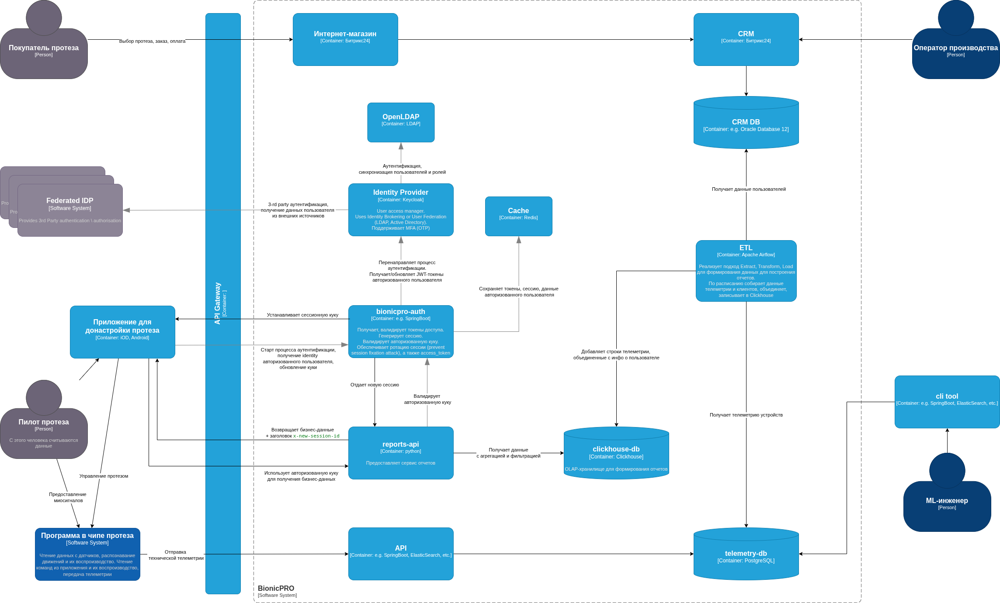
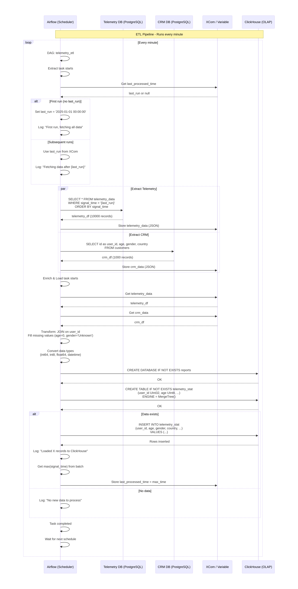
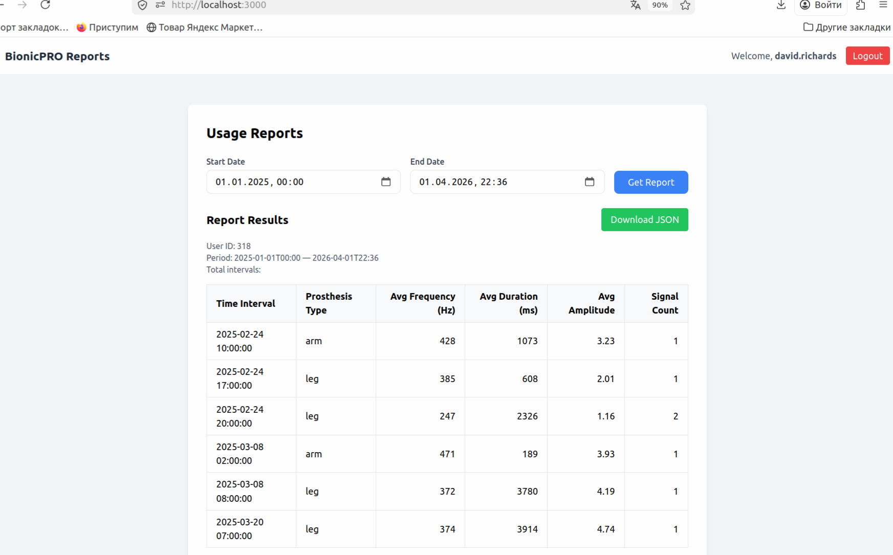
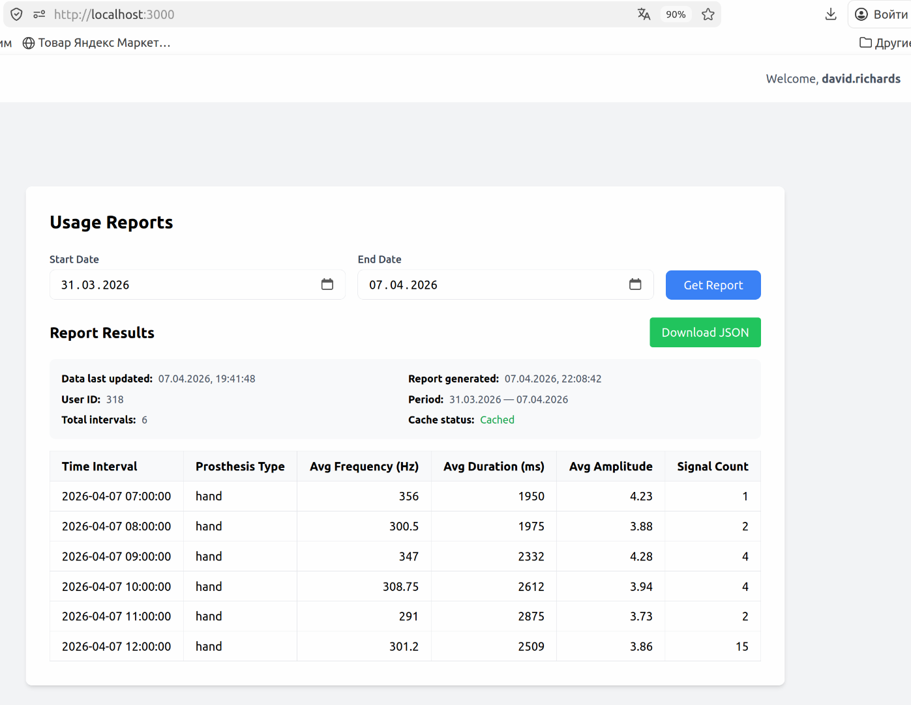

# Кейс компании BionicPRO
## Цели бизнеса
Компания BionicPRO ставит перед собой следующие цели:
1) Злоумышленники не должны использовать уязвимость SSO в приложении.
2) У пользователей должна быть возможность скачать данные о работе протеза в виде отчёта. Чтобы реализовать эту функциональность, необходимо выгружать данные из CRM в ClickHouse. Для этого требуется написать отдельное приложение, которое сможет предоставлять отчёт из нескольких источников — CRM и DB.
3) Пользователь должен иметь доступ только к тем отчётам, которые содержат данные о его протезе или протезах. Доступ к информации о других пользователях должен быть закрыт.

## Задание 1. Повышение безопасности системы
### Задача 1. Предложите архитектурное решение и доработайте диаграмму C4 для управления учётными данными пользователя. 


### Задача 2. Улучшите безопасность существующего приложения, заменив Code Grant на PKCE.
_Его нужно добавить к уже существующим приложениям — фронтенду и Keycloak._

[PKCE code](./app_pkce)

```bash
cd ./app_pkce
docker compose up -d
```


### Задача 3. Обеспечьте безопасное получение и хранение access-и refresh-токенов.
### Задача 4. Добавьте LDAP для возможности получения данных о пользователях представительства BionicPRO в другой стране.
### Задача 5. Настройте MFA.

```bash
docker compose up -d
```

#### Keycloak Panel
http://localhost:8080/admin/master/console/

#### Application

http://localhost:3000/

#### Диаграмма последовательности процесса аутентификации\авторизации пользователя


##### Выгрузка конфига из Keycloak
```bash
docker exec bionicpro-keycloak-1 /opt/keycloak/bin/kc.sh export --realm reports-realm --file /tmp/realm-export.json
docker cp bionicpro-keycloak-1:/tmp/realm-export.json ./keycloak/keycloak-results-export.json
```

[keycloak-results-export.json](keycloak/keycloak-results-export.json)

### Задача 6. Добавьте OAuth 2.0 от Яндекс ID.

https://github.com/playa-ru/keycloak-russian-providers

```bash 
mkdir -p keycloak/providers

wget -O keycloak-russian-providers-21.1.1.rsp.jar \
  https://repo1.maven.org/maven2/ru/playa/keycloak/keycloak-russian-providers/21.1.1.rsp/keycloak-russian-providers-21.1.1.rsp.jar

wget -O keycloak/providers/json-path-2.7.0.jar \
  https://repo1.maven.org/maven2/com/jayway/jsonpath/json-path/2.7.0/json-path-2.7.0.jar

wget -O keycloak/providers/json-smart-2.4.7.jar \
  https://repo1.maven.org/maven2/net/minidev/json-smart/2.4.7/json-smart-2.4.7.jar

wget -O keycloak/providers/accessors-smart-2.4.7.jar \
  https://repo1.maven.org/maven2/net/minidev/accessors-smart/2.4.7/accessors-smart-2.4.7.jar

wget -O keycloak/providers/asm-9.3.jar \
  https://repo1.maven.org/maven2/org/ow2/asm/asm/9.3/asm-9.3.jar
  
docker compose up --build -d
```

## Задание 2. Разработка сервиса отчётов
### Задача 1. Создать архитектуру решения для подготовки и получения отчётов.



### Задача 2. Разработать Airflow DAG и настроить его на запуск по расписанию.
#### Диаграмма последовательности процесса ETL


### Задача 3. Создайте бэкенд-часть приложения для API.
### Задача 4. Реализуйте ограничение доступа к эндпоинту отчётности.
### Задача 5. Добавьте в UI кнопку получения отчёта и вызова эндпоинта его генерации.

```bash
docker compose up --build -d
```

#### Тестовые пользователи (ldap)
- rebecca.harmon / password (id = 871)
- david.richards / password (id = 318)



#### Диаграмма последовательности получения отчетов и валидации\ротации сессии


## Задание 3. Снижение нагрузки на базу данных
_После внедрении фичи о получении пользовательской отчётности нагрузка на базу данных отчётности существенно возросла. Пользователи стали часто запрашивать свои отчёты. Но поскольку данные обновляются с помощью ETL-процесса по расписанию, на эти запросы пользователи получают одинаковые отчёты.
Ваша задача — во-первых, снизить нагрузку на OLAP-базу, исключив необходимость повторных запросов для уже сформированных отчётов, а во-вторых, разработать механизм, который будет сохранять отчёты по пользователям в объектное хранилище S3 и раздавать их через CDN._

### Пайплайн (ETL + API + CDN + S3)
1. ETL запускается по расписанию
2. Загружает новые данные
3. Обновляет etl_version.json в S3 (меняется метка времени)
4. Пользователь запрашивает отчёт
5. API видит, что версия отчёта (в метаданных) не совпадает с текущей
6. Генерирует новый отчёт
7. Сохраняет его в S3 с новой версией в метаданных
8. Отдаёт CDN ссылку
9. При повторном запросе (до следующего ETL) edge cache отдаёт кешированную версию

[main.etl_join.py](report-api/main.etl_join.py)
[dag_telemetry_etl.py](airflow/dags/telemetry_etl.py)

```bash
docker compose up -d
```

Сброс переменной с датой последней загруженной записи 

```bash
docker exec bionicpro-airflow-webserver-1 airflow variables delete telemetry_last_processed_time
```



## Задание 4. Повышение оперативности и стабильности работы CRM
_База данных CRM увеличилась, и выполнение запросов на массовую выгрузку данных стало приводить к значительной нагрузке на систему. Это негативно сказывается на работе OLTP-запросов: они замедляются и часто завершаются ошибками. Это, в свою очередь, влияет на оперативность и стабильность работы CRM.
Ваша задача — обеспечить разделение потоков операций: запросы на выгрузку не должны влиять на транзакционные операции в CRM._

### Пайплайн (CDC + ETL + API + CDN + S3)
1. CDC (Debezium + Kafka) отслеживает изменения в CRM PostgreSQL в реальном времени
2. ClickHouse читает из Kafka и обновляет customers_snapshot (актуальное состояние CRM)
3. ETL (Airflow) запускается по расписанию (каждый час):
    - Загружает новые данные телеметрии из PostgreSQL
    - Записывает в ClickHouse (telemetry_raw)
4. При вставке в telemetry_raw срабатывает MaterializedView:
    - JOIN с customers_snapshot
    - Обогащённые данные попадают в telemetry_enriched
5. Пользователь запрашивает отчёт
6. API проверяет сессию, получает user_id из customers_snapshot
7. API проверяет наличие свежего отчёта в S3 (TTL 5 минут):
    - Есть → отдаёт CDN ссылку (кеш)
    - Нет → генерирует отчёт из telemetry_enriched
8. Сгенерированный отчёт сохраняется в S3, возвращается CDN ссылка
9. Nginx (CDN) кеширует отчёт и отдаёт при повторных запросах

[main.py](report-api/main.py)
[dag_telemetry_raw_etl.py](airflow/dags/telemetry_raw_etl.py)

```bash
docker compose up -d
```

```bash
curl -X POST http://localhost:8083/connectors \
  -H "Content-Type: application/json" \
  -d '{
    "name": "crm-connector",
    "config": {
      "connector.class": "io.debezium.connector.postgresql.PostgresConnector",
      "database.hostname": "crm_db",
      "database.port": "5432",
      "database.user": "crm_user",
      "database.password": "crm_password",
      "database.dbname": "crm_db",
      "database.server.name": "crm",
      "plugin.name": "pgoutput",
      "table.include.list": "public.customers",
      "topic.prefix": "crm",
      "snapshot.mode": "initial",
      "key.converter": "org.apache.kafka.connect.json.JsonConverter",
      "value.converter": "org.apache.kafka.connect.json.JsonConverter",
      "key.converter.schemas.enable": "false",
      "value.converter.schemas.enable": "false",
      "transforms": "unwrap",
      "transforms.unwrap.type": "io.debezium.transforms.ExtractNewRecordState",
      "transforms.unwrap.drop.tombstones": "false"
    }
  }'
```

```bash
curl -s http://localhost:8083/connectors/crm-connector/status | jq

docker exec bionicpro-kafka kafka-topics --bootstrap-server localhost:9092 --list | grep crm
```