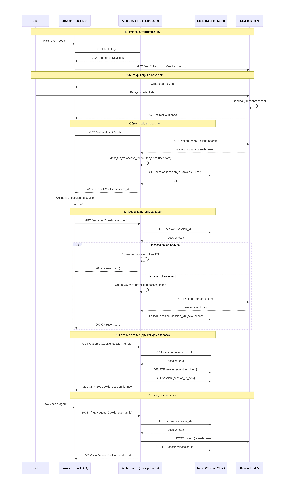

# Кейс компании BionicPRO
## Цели бизнеса
Компания BionicPRO ставит перед собой следующие цели:
1) Злоумышленники не должны использовать уязвимость SSO в приложении.
2) У пользователей должна быть возможность скачать данные о работе протеза в виде отчёта. Чтобы реализовать эту функциональность, необходимо выгружать данные из CRM в ClickHouse. Для этого требуется написать отдельное приложение, которое сможет предоставлять отчёт из нескольких источников — CRM и DB.
3) Пользователь должен иметь доступ только к тем отчётам, которые содержат данные о его протезе или протезах. Доступ к информации о других пользователях должен быть закрыт.

## Задание 1. Повышение безопасности системы
### Задача 1. Предложите архитектурное решение и доработайте диаграмму C4 для управления учётными данными пользователя. 


### Задача 2. Улучшите безопасность существующего приложения, заменив Code Grant на PKCE.
_Его нужно добавить к уже существующим приложениям — фронтенду и Keycloak._

[PKCE](./Task_1/app_pkce)

```bash
cd ./Task_1/app_pkce
docker compose up -d
```

### Задача 3. Обеспечьте безопасное получение и хранение access-и refresh-токенов.

[Backend Auth Service](./Task_1/app_bionicpro_auth)

```bash
cd ./Task_1/app_bionicpro_auth
docker compose up -d
```

#### Keycloak Panel
http://localhost:8080/admin/master/console/

#### Application
http://localhost:3000/

